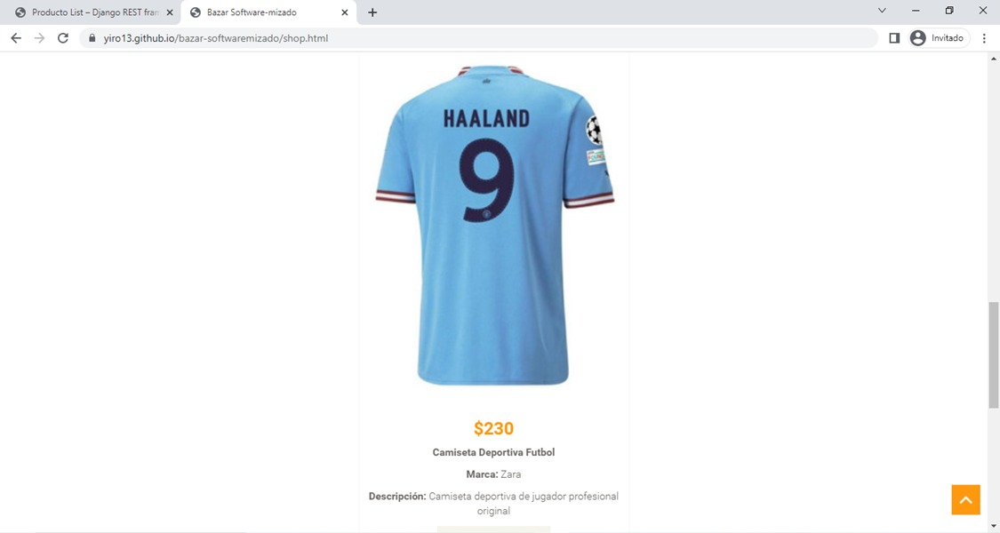
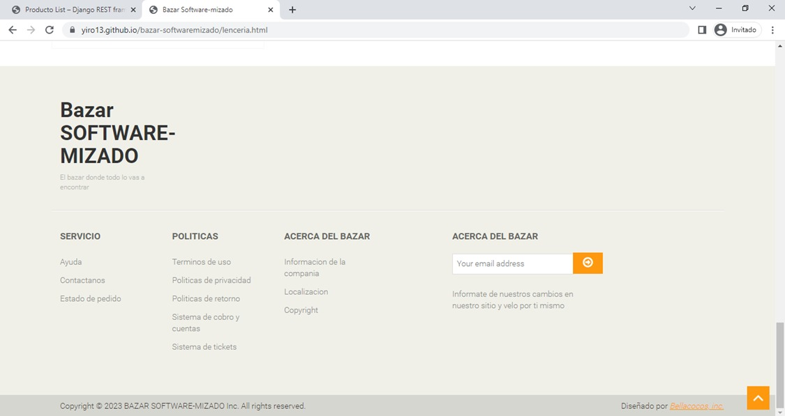

# bazar-softwaremizado

Ana María Rojas Pérez
Salma Vázquez Herrera
Edgar Aguilar Garcia
Yahir Alejandro Bañuelos Leo

# Frontend

El desarrollo frontend implicó la creación de la interfaz de usuario, que incluye el diseño visual, la disposición de los elementos en la pantalla, la interactividad y la experiencia del usuario. Se basa en tecnologías HTML (HyperText Markup Language), CSS (Cascading Style Sheets) y JavaScript.

# Backend

El desarrollo del backend implicó la creación de la lógica de programación, la implementación de algoritmos, la gestión de bases de datos y la manipulación de datos.

# Tecnologías

## HTML

HTML (HyperText Markup Language) es el lenguaje de marcado estándar utilizado para crear y estructurar el contenido de páginas web. Es la base fundamental de la mayoría de los sitios web en Internet.

HTML utiliza una serie de etiquetas para definir la estructura y el formato de un documento web. Cada etiqueta tiene una función específica y se utiliza para marcar distintos elementos en una página, como encabezados, párrafos, enlaces, imágenes, listas, tablas, formularios, entre otros.

## CSS

CSS (Cascading Style Sheets) es un lenguaje de hojas de estilo utilizado para describir el aspecto y el formato de un documento HTML o XML. Se utiliza para definir la presentación visual de los elementos y la disposición de una página web.

Con CSS, puedes controlar el color, la tipografía, el espaciado, el tamaño, la posición y otros aspectos visuales de los elementos HTML. Permite separar el contenido de un documento de su presentación, lo que facilita la gestión y el mantenimiento del diseño de un sitio web.

## JavaScript

JavaScript es un lenguaje de programación de alto nivel, orientado a objetos e interpretado. Es ampliamente utilizado en el desarrollo web para agregar interactividad y dinamismo a las páginas.

A diferencia de HTML y CSS, que se enfocan en la estructura y la presentación de una página web, JavaScript se centra en la programación y la manipulación de elementos HTML, la interacción con el usuario y el procesamiento de datos.

